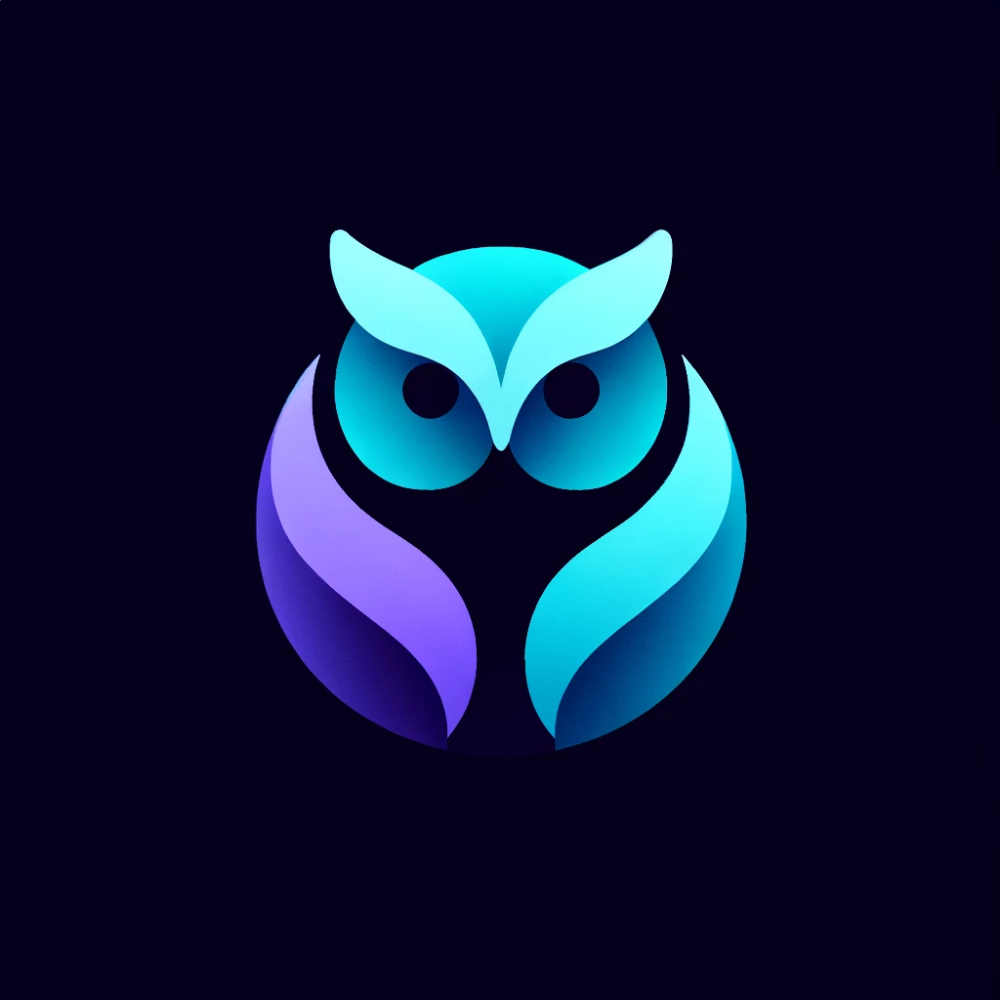

### Hi there 👋

<table>
  <tr>
    <!-- First Column -->
    <td valign="top" width="50%">
      🔭 I am currently a **Machine Learning Engineer**.
      🌱 I am currently learning **Rust** and also delving into the **Open Source** community.
      🎯 My goal is to contribute meaningfully and help others.
      ✨ I love to share what I learn on my blog [reinforcedknowledge.com](https://reinforcedknowledge.com).
      📫 How to reach me: reinforced.knowledge@gmail.com
    </td>
    <!-- Second Column -->
    <td valign="top" width="50%">
    
    </td>    
  </tr>
</table>

<!--
**ReinforcedKnowledge/ReinforcedKnowledge** is a ✨ _special_ ✨ repository because its `README.md` (this file) appears on your GitHub profile.

Here are some ideas to get you started:

- 🔭 I’m currently working on ...
- 🌱 I’m currently learning ...
- 👯 I’m looking to collaborate on ...
- 🤔 I’m looking for help with ...
- 💬 Ask me about ...
- 📫 How to reach me: ...
- 😄 Pronouns: ...
- ⚡ Fun fact: ...
-->
